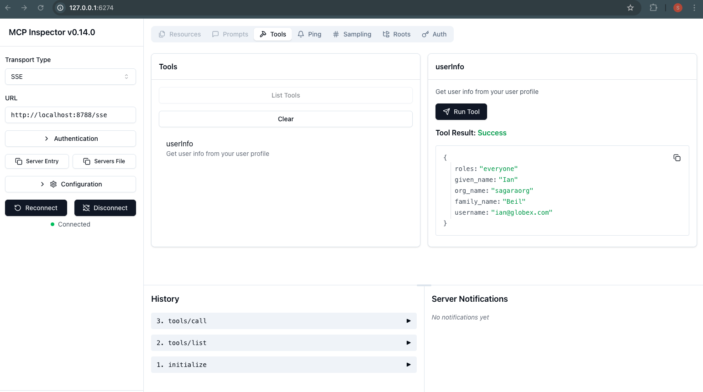
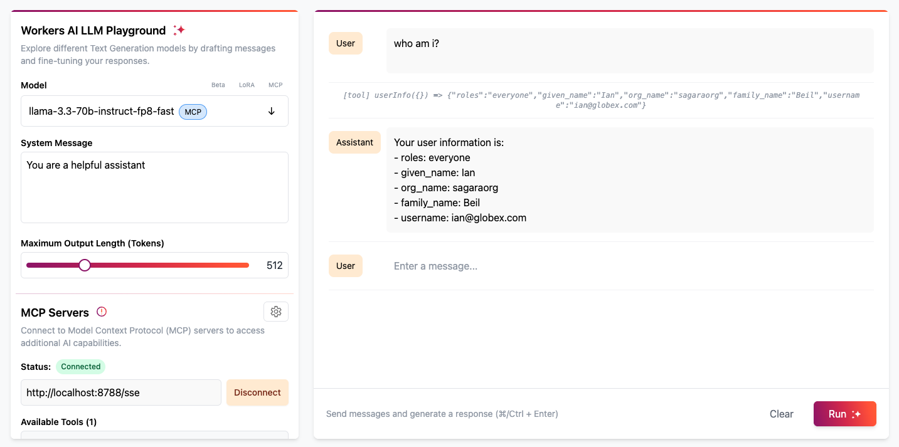

# Model Context Protocol (MCP) Server + Asgardeo

This is a sample [Model Context Protocol (MCP)](https://modelcontextprotocol.io/introduction) server that supports remote MCP clients to connect and authenticate using [Asgardeo](https://wso2.com/asgardeo/).

Asgardeo authenticates users accessing the MCP server and allows you to control tool access based on application-level and organization-level permissions defined for each user.


The MCP server is powered by [Cloudflare Workers](https://developers.cloudflare.com/workers/):

- Acts as OAuth _Server_ to your MCP clients
- Acts as OAuth/OIDC _Client_ to your Asgardeo organization


## Getting Started

Before you start make sure you have the following prerequisites:
- [Asgardeo account](https://wso2.com/asgardeo/docs/get-started/create-asgardeo-account/). 
- Install [Node.js](https://nodejs.org/en/download/package-manager) version 18.x or higher on your system.
- A [Cloudflare](https://www.cloudflare.com/en-gb/lp/pg-one-platform-ppc/)account for deployment


### Configure Asgardeo

First, sign into Asgardeo console and navigate to **Applications > New Application.**

Then, select Traditional Web Application and complete the wizard popup by providing the following given name and the authorized redirect URL.(Ensure that the protocol remains set to OpenID Connect (OIDC).) 

- **Application Name** : CloudflareMCPServer
- **Authorized redirect URL** : http://localhost:8788/callback


***Note*** - *The `http://localhost:8788/callback` is only used during the local testing, the callback URL from Cloudflare deployment will be added at a later stage.* 

Make a note of the following values from the **Protocol** and **Info** tabs of the registered application. 

- **client-id** from the **Protocol** tab.
- **client-secret** from the **Protocol** tab.
- Your **Asgardeo organization name**

---

## Local Development and Testing 


Clone the repo directly & install dependencies using the following given instructions. 

```bash

# Clone the repository
git clone https://github.com/sagara-gunathunga/cloudflare-mcp-asgardeo

# Move to the demo project directory
cd demo-mcp-server

## Install dependencies
npm install

```

Next, create a **`.dev.vars`** file in your project root with the following values. 

```
# .dev.vars
ASGARDEO_CLIENT_ID=<client-id from the previous step>
ASGARDEO_CLIENT_SECRET=<client-secret from the previous step>
ASGARDEO_BASE_URL=https://api.asgardeo.io/t/<Asgardeo organization name>
ASGARDEO_SCOPE=openid profile email roles
```

#### Develop & Test
Run the server locally to make it available at `http://localhost:8788`

```
npm run dev

```

To authenticate with Asgardeo, you must first have a user account created. If you haven’t done so already, follow this [guide](https://wso2.com/asgardeo/docs/guides/users/manage-users/#onboard-single-user) to create a user in Asgardeo.

Next, start MCP [Inspector](https://modelcontextprotocol.io/docs/tools/inspector) locally using the following command. 

```
npx @modelcontextprotocol/inspector

```

To test the local server, switch the Transport Type to `SSE` and enter `http://localhost:8788/sse` in the Inspector and hit connect. Once you follow the prompts, you’ll be able to authenticate with Asgardeo and use features such as “List Tools” in the Inspector. When you invoke the userInfo tool, you should see results similar to the example shown in the screenshot below.




Alternatively, you can test using the [**Cloudflare Workers AI LLM Playground**](https://playground.ai.cloudflare.com/).
Simply enter `http://localhost:8787/sse` as the MCP server URL and click **Connect**. This will redirect you to the Asgardeo login page. Once you've completed the login process, you’ll be able to interact with the LLM in the Playground and use the tools defined in your MCP server.

For example, try asking the LLM: **“Who am I?”**




### Deploying to Cloudflare

First, create a KV namespace in Cloudflare using the following command. 

```bash
npx wrangler kv namespace create OAUTH_KV
```

Make sure to update **wrangler.jsonc** file with the **id** value received after running the above command. 

```
"kv_namespaces": [
  {
    "binding": "OAUTH_KV",
    "id": "<your-kv-id>"
  }
],
```


Then, set the following secrets via Wrangler by running the following commands. 


```bash
npx wrangler@latest secret put ASGARDEO_CLIENT_ID
npx wrangler@latest secret put ASGARDEO_CLIENT_SECRET
npx wrangler@latest secret put ASGARDEO_BASE_URL
npx wrangler@latest secret put ASGARDEO_SCOPE
npx wrangler@latest secret put COOKIE_ENCRYPTION_KEY # add any random string here e.g. openssl rand -hex 32
```

You can use the values stored in  **`.dev.vars`** file with the above command. 


#### Deploy & Test
Deploy the MCP server to make it available on your workers.dev domain.


```bash
npx wrangler@latest deploy
```


Make a note of the newly created **Cloudflare Worker URL**, which is printed as output when you run the deployment command. You can also find this URL by logging into the **Cloudflare web console**. The Worker URL typically follows this format:`https://remote-mcp-asgardeo.<your-subdomain>.workers.dev`

Next, you need to **configure a callback URL** using the above Worker URL. The complete callback URL should take the following format.

```bash
https://remote-mcp-asgardeo.<your-subdomain>.workers.dev/callback
```

To set it up:

1. Log in to the **Asgardeo Console**.
2. Navigate to the application you created.
3. Go to the **Protocol** tab.
4. Add above value into **Authorized redirect URLs**  so that Asgardeo can recognize it as a valid redirect URL.


The connection URL of the MCP server that we deployed into Cloudflare take the following format. 

```bash
https://remote-mcp-asgardeo.<your-subdomain>.workers.dev/sse
```

To test the remote server, switch the Transport Type to `SSE` and enter `https://remote-mcp-asgardeo.<your-subdomain>.workers.dev/sse` in the Inspector and hit connect. Once you follow the prompts, you’ll be able to authenticate with Asgardeo and use features such as “List Tools” in the Inspector. When you invoke the userInfo tool. 


Alternatively, you can test using the [**Cloudflare Workers AI LLM Playground**](https://playground.ai.cloudflare.com/).
Simply enter `https://remote-mcp-asgardeo.<your-subdomain>.workers.dev/sse` as the MCP server URL and click **Connect**. This will redirect you to the Asgardeo login page. Once you've completed the login process, you’ll be able to interact with the LLM in the Playground and use the tools defined in your MCP server.

For example, try asking the LLM: **“Who am I?”**


#### Using Cursor and other MCP Clients

To connect Cursor with your MCP server, choose `Type`: "Command" and in the `Command` field, combine the command and args fields into one (e.g. `npx mcp-remote https://<your-worker-name>.<your-subdomain>.workers.dev/sse`).

Note that while Cursor supports HTTP+SSE servers, it doesn't support authentication, so you still need to use `mcp-remote` (and to use a STDIO server, not an HTTP one).

You can connect your MCP server to other MCP clients like Windsurf by opening the client's configuration file, adding the same JSON that was used for the Claude setup, and restarting the MCP client.


### Access Control


This MCP server uses **Asgardeo** for both authentication and access control.

* All **authenticated users** have access to the `userInfo` tool.
* Users with the **`manager` role** can access the `getDirectReportees` tool. For others, this tool will not be visible.

To support this role-based access scenario, Asgardeo returns user roles for authenticated users, allowing the MCP server to evaluate permissions accordingly.

To try this out:

1. Create a new role called `manager` in Asgardeo.
2. Assign the role to a user by following [this guide](https://wso2.com/asgardeo/docs/guides/users/manage-roles/).
3. Ensure that user roles are configured to be returned as attributes in the ID token or user info endpoint by following the relevant configuration instructions [here](https://wso2.com/asgardeo/docs/guides/users/attributes/manage-attributes/).


### Access the remote MCP server from Claude Desktop

Open Claude Desktop and navigate to Settings -> Developer -> Edit Config. This opens the configuration file that controls which MCP servers Claude can access.

Replace the content with the following configuration. Once you restart Claude Desktop, a browser window will open showing your OAuth login page. Complete the authentication flow to grant Claude access to your MCP server. After you grant access, the tools will become available for you to use. 

```
{
  "mcpServers": {
    "math": {
      "command": "npx",
      "args": [
        "mcp-remote",
        "https://mcp-github-oauth.<your-subdomain>.workers.dev/sse"
      ]
    }
  }
}
```

Once the Tools (under 🔨) show up in the interface, you can ask Claude to use them. 


